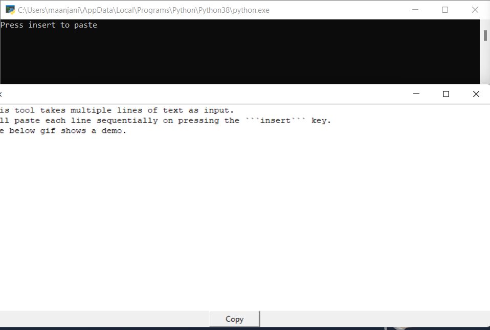

# Sequential Text Inserter

- This tool takes multiple lines of text as input. (As shown below)
- Will paste each line sequentially on pressing the ```insert``` key.



## To Run

### Step 1: Install required packages
```pip install -r requirements.txt```
### Step 2: Run clipboard.py using python 3
```py clipboard.py```